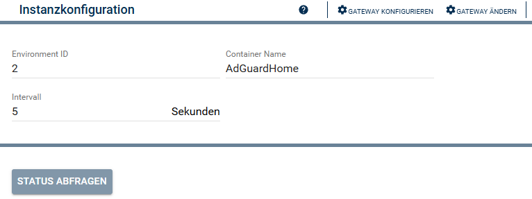
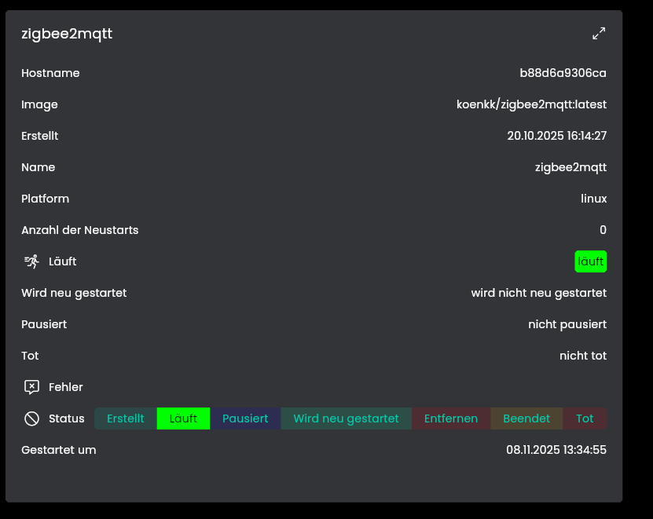
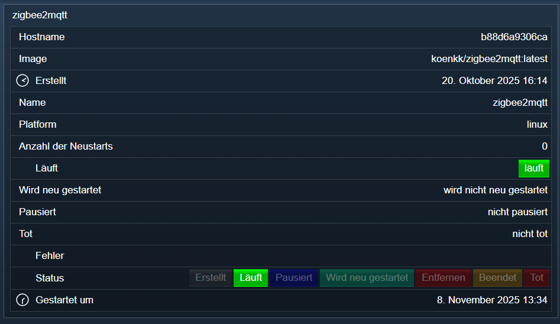

[](https://www.symcon.de/service/dokumentation/entwicklerbereich/sdk-tools/sdk-php/)
[](https://community.symcon.de/t/modul-portainer/142355)
[](https://www.symcon.de/de/service/dokumentation/installation/migrationen/v80-v81-q3-2025/)  
[](https://creativecommons.org/licenses/by-nc-sa/4.0/)
[](https://github.com/Nall-chan/Portainer/actions) [](https://github.com/Nall-chan/Portainer/actions)  
[](#2-spenden)
[](#2-spenden)  

# Docker Container <!-- omit in toc -->  

### Inhaltsverzeichnis

- [4. Einrichten der Instanzen in IP-Symcon](#4-einrichten-der-instanzen-in-ip-symcon)
  - [Konfigurationsseite](#konfigurationsseite)
  - [5. Statusvariablen](#5-statusvariablen)
    - [Statusvariablen](#statusvariablen)
  - [6. Visualisierung](#6-visualisierung)
    - [Kachel Visualisierung](#kachel-visualisierung)
    - [WebFront](#webfront)
  - [7. PHP-Befehlsreferenz](#7-php-befehlsreferenz)
- [8. Aktionen](#8-aktionen)
- [9. Anhang](#9-anhang)
  - [1. Changelog](#1-changelog)
  - [2. Spenden](#2-spenden)
- [10. Lizenz](#10-lizenz)

### 1. Funktionsumfang

- Instanz welche den Zustand eines Docker Containers in Symcon abbildet.  

### 2. Voraussetzungen

- IP-Symcon ab Version 8.1
- Portainer Installation  
  
### 3. Software-Installation

- Dieses Modul ist Bestandteil der [Portainer-Library](../README.md#4-software-installation).  

## 4. Einrichten der Instanzen in IP-Symcon

 Unter `Instanz hinzufügen` ist das `Docker Container`-Modul unter dem Hersteller `Portainer` aufgeführt.  
  

 Es wird empfohlen diese Instanz über die dazugehörige Instanz des [Portainer Konfigurator-Moduls](../Portainer%20Configurator/README.md) anzulegen.  

  

### Konfigurationsseite  

| Eigenschaft   | Text           | Beschreibung                                                   |
| ------------- | -------------- | -------------------------------------------------------------- |
| EnvironmentId | Environment ID | Portainer ID des Environment unter welchem der Container läuft |
| ContainerName | Container Name | Container Name zur Identifizierung des Container               |
| Interval      | Intervall      | Intervall der Statusaktualisierung                             |

### 5. Statusvariablen  

Die Statusvariablen werden automatisch erzeugt.  

#### Statusvariablen

| Name                 | Typ     |
| -------------------- | ------- |
| Hostname             | string  |
| Image                | string  |
| Erstellt             | integer |
| Name                 | string  |
| Platform             | string  |
| Anzahl der Neustarts | integer |
| Läuft                | bool    |
| Wird neu gestartet   | bool    |
| Pausiert             | bool    |
| Tot                  | bool    |
| Fehler               | integer |
| Status               | integer |
| Gestartet um         | integer |

### 6. Visualisierung

#### Kachel Visualisierung  

  

#### WebFront  

  

### 7. PHP-Befehlsreferenz

Zustandsabfrage des Containers.  

```php
boolean PORTAINER_RequestState(integer $InstanzID);
```

Beispiel:  

```php
PORTAINER_RequestState(12345);
```

-------

Starten des Containers.  

```php
boolean PORTAINER_StartContainer(integer $InstanzID);
```

Beispiel:  

```php
PORTAINER_StartContainer(12345);
```

-------

Beenden des Containers.  

```php
boolean PORTAINER_StopContainer(integer $InstanzID);
```

Beispiel:  

```php
PORTAINER_StopContainer(12345);
```

-------

Pausieren des Containers.  

```php
boolean PORTAINER_PauseContainer(integer $InstanzID);
```

Beispiel:  

```php
PORTAINER_PauseContainer(12345);
```

-------

Fortsetzen des pausierten Containers.  

```php
boolean PORTAINER_UnpauseContainer(integer $InstanzID);
```

Beispiel:  

```php
PORTAINER_UnpauseContainer(12345);
```

-------

Neustarten des Containers.  

```php
boolean PORTAINER_RestartContainer(integer $InstanzID);
```

Beispiel:  

```php
PORTAINER_RestartContainer(12345);
```

-------

Zwangsweises beenden des Containers (killen).  

```php
boolean PORTAINER_KillContainer(integer $InstanzID);
```

Beispiel:  

```php
PORTAINER_KillContainer(12345);
```

## 8. Aktionen

Es gibt keine speziellen Aktionen für dieses Modul.  

## 9. Anhang

### 1. Changelog

[Changelog der Library](../README.md#2-changelog)

### 2. Spenden

  Die Library ist für die nicht kommerzielle Nutzung kostenlos, Schenkungen als Unterstützung für den Autor werden hier akzeptiert:  

[](https://paypal.me/Nall4chan)  

[](https://www.amazon.de/hz/wishlist/ls/YU4AI9AQT9F?ref_=wl_share)

## 10. Lizenz

  IPS-Modul:  
  [CC BY-NC-SA 4.0](https://creativecommons.org/licenses/by-nc-sa/4.0/)  
