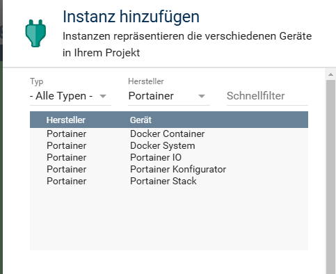
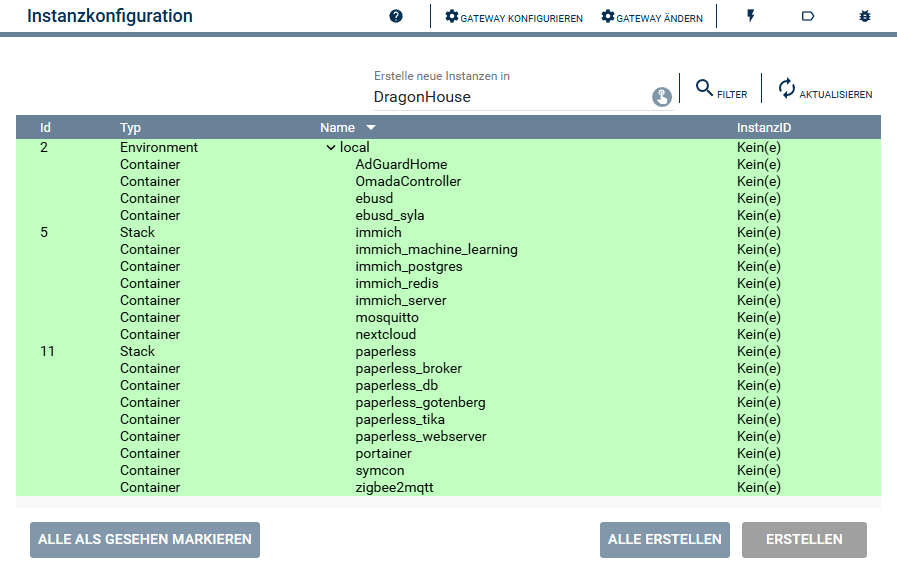

  

   

  

# Portainer Konfigurator <!-- omit in toc -->  

## Inhaltsverzeichnis

- [Inhaltsverzeichnis](#inhaltsverzeichnis)
  - [1. Funktionsumfang](#1-funktionsumfang)
  - [2. Voraussetzungen](#2-voraussetzungen)
  - [3. Software-Installation](#3-software-installation)
  - [4. Einrichten der Instanzen in IP-Symcon](#4-einrichten-der-instanzen-in-ip-symcon)
- [5. Statusvariablen](#5-statusvariablen)
- [6. Visualisierung](#6-visualisierung)
- [7. PHP-Befehlsreferenz](#7-php-befehlsreferenz)
- [8. Aktionen](#8-aktionen)
- [9. Anhang](#9-anhang)
  - [1. Changelog](#1-changelog)
  - [2. Spenden](#2-spenden)
- [10. Lizenz](#10-lizenz)

### 1. Funktionsumfang

- Konfigurator zum einfachen anlegen von Instanzen in Symcon.  

### 2. Voraussetzungen

- IP-Symcon ab Version 8.1
- Portainer Installation  

### 3. Software-Installation

- Dieses Modul ist Bestandteil der [Portainer-Library](../README.md#4-software-installation).  

### 4. Einrichten der Instanzen in IP-Symcon

 Unter `Instanz hinzufügen` ist das `Portainer Konfigurator`-Modul unter dem Hersteller `Portainer` aufgeführt.  

### Konfigurationsseite <!-- omit in toc -->  

## 5. Statusvariablen

Dieses Modul erstellt keine Statusvariablen.  

## 6. Visualisierung

Dieses Modul ist nicht für die Visualisierung geeignet.

## 7. PHP-Befehlsreferenz

Dieses Modul stellt keine Instanz-Funktionen bereit.

## 8. Aktionen

Es gibt keine speziellen Aktionen für dieses Modul.  

## 9. Anhang

### 1. Changelog

[Changelog der Library](../README.md#2-changelog)

### 2. Spenden

  Die Library ist für die nicht kommerzielle Nutzung kostenlos, Schenkungen als Unterstützung für den Autor werden hier akzeptiert:  

  

  

## 10. Lizenz

  IPS-Modul:  
  [CC BY-NC-SA 4.0](https://creativecommons.org/licenses/by-nc-sa/4.0/)
