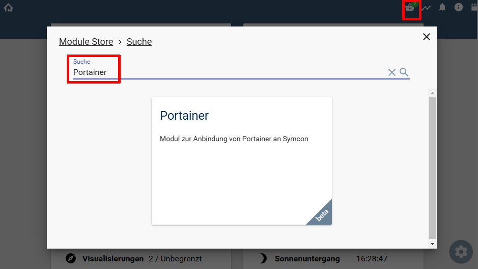
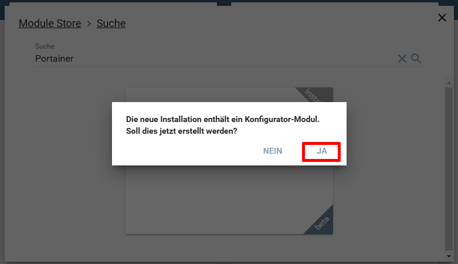
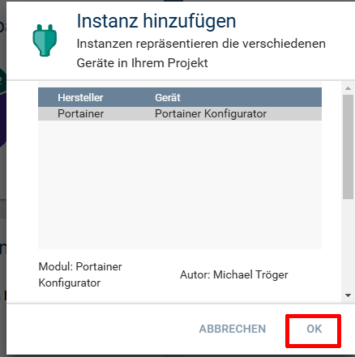
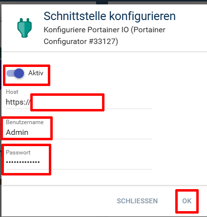

  

   

  

# Portainer <!-- omit in toc -->  

## Inhaltsverzeichnis <!-- omit in toc -->

- [1. Vorbemerkungen](#1-vorbemerkungen)
- [2. Voraussetzungen](#2-voraussetzungen)
- [3. Enthaltende Module](#3-enthaltende-module)
- [4. Software-Installation](#4-software-installation)
- [5. Einrichten der Instanzen in IP-Symcon](#5-einrichten-der-instanzen-in-ip-symcon)
- [6. Anhang](#6-anhang)
	- [1. GUID der Module](#1-guid-der-module)
	- [2. Changelog](#2-changelog)
	- [3. Spenden](#3-spenden)
- [7. Lizenz](#7-lizenz)

----------

## 1. Vorbemerkungen

Diese Library enthält nur wenige Funktionen der sehr umfangreichen Portainer API.  
Sie wurde entwickelt um eine einfache Überwachung von laufenden Containern zu ermöglichen und diese zu starten, beenden oder neu zu starten.  

## 2. Voraussetzungen

- IP-Symcon ab Version 8.1
- Portainer Installation

## 3. Enthaltende Module

Folgende Module beinhaltet die Portainer Bibliothek:

- __Portainer Konfigurator__ ([Dokumentation](Portainer%20Configurator/README.md))  
  Konfigurator welcher das einfache anlegen von Stack, Container und System Instanzen erlaubt.  

- __Portainer IO__ ([Dokumentation](Portainer%20IO/README.md))  
  IO Instanz zur Kommunikation mit Portainer.  

- __Portainer Stack__ ([Dokumentation](Portainer%20Stack/README.md))  
  Instanz welche einen Stack von Portainer abbildet.  

- __Docker Container__ ([Dokumentation](Docker%20Container/README.md))  
  Instanz welche einen Docker Container in abbildet.  

- __Docker System__ ([Dokumentation](Docker%20System/README.md))  
  Instanz welche ein Docker Environment abbildet.  

## 4. Software-Installation

  Über den `Module-Store` in IPS das Modul `Portainer` hinzufügen.  
  __Bei kommerzieller Nutzung (z.B. als Errichter oder Integrator) wenden Sie sich bitte an den Autor.__ 

  

## 5. Einrichten der Instanzen in IP-Symcon

Details sind direkt in der Dokumentation der jeweiligen Module beschrieben.  
Es wird empfohlen die Einrichtung mit der Konfigurator-Instanz zu starten [Portainer Konfigurator](Portainer%20Configurator/README.md).  
Nach der installation aus dem Store wird diese Instanz auf Rückfrage automatisch angelegt.
  
  
 Dabei wird die Konfiguration bis zum [Portainer IO](Portainer%20IO/README.md) durchlaufen.  
  
Sind die Eingaben korrekt, so wird der [Portainer Konfigurator](Portainer%20Configurator/README.md) geöffnet.
  

## 6. Anhang

### 1. GUID der Module

| Modul                  | Typ          | Prefix    | GUID                                   |
| ---------------------- | ------------ | --------- | -------------------------------------- |
| Portainer IO           | IO           | PORTAINER | {FEB4D3D2-AD8A-9C6A-72D8-DF99AC625768} |
| Portainer Configurator | Configurator | PORTAINER | {781E99AA-6F79-4430-0DF5-388D82E29019} |
| Portainer Stack        | Device       | PORTAINER | {B4110D02-0282-F7F6-363C-906280A3510A} |
| Portainer System       | Device       | PORTAINER | {80544234-7E77-8F76-8376-D6C285B58443} |
| Portainer Container    | Device       | PORTAINER | {80AA764D-EABE-B85E-D997-43A2D244D6E8} |

### 2. Changelog

__Version 0.8:__  

- Start der Beta Version  

### 3. Spenden  
  
  Die Library ist für die nicht kommerzielle Nutzung kostenlos, Schenkungen als Unterstützung für den Autor werden hier akzeptiert:  

  

## 7. Lizenz

  [CC BY-NC-SA 4.0](https://creativecommons.org/licenses/by-nc-sa/4.0/)
  